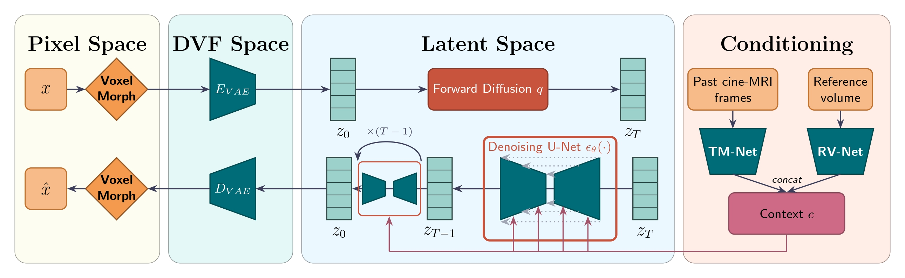

# TIDAL

> **T**emporal **I**mage-conditioned **D**iffusion model for **A**natomical **L**iver deformation forecasting

Conditional latent diffusion model for real-time 3D liver (and cardiac) motion prediction in MRI-guided radiotherapy.

[Architecture](#architecture) · [Results](#results) · [Installation](#installation) · [Training](#training) · [Project structure](#project-structure) · [Citation](#citation)

---

## Abstract

Radiotherapy requires precise delivery of radiation to tumors while sparing healthy tissue, a task severely complicated in thoracic and abdominal treatments by respiratory-induced organ motion. MRI-guided radiotherapy addresses this by enabling real-time soft-tissue visualization during beam delivery, but remains constrained by workflow latency and by 2D cine-MRI acquisitions that cannot capture out-of-plane, fully volumetric motion.

TIDAL reformulates real-time liver motion compensation as a **conditional 3D volume generation problem**. It jointly leverages a high-resolution 3D reference MRI acquired prior to treatment, and a stream of real-time 2D cine-MRI navigator observations, to predict future 3D liver deformation fields ahead of beam delivery.

---

## Architecture

<p align="center">
  
  <br/>
  <em>Figure 1 — TIDAL pipeline.</em>
</p>

The pipeline operates across four spaces:

| Stage | Module | Role |
|-------|--------|------|
| **Pixel space** | MambaMorph | Computes DVFs between consecutive MRI frames |
| **DVF space** | DVFVAE (E) | Encodes DVF volumes into a compact latent representation |
| **Latent space** | UNet3D | Denoises latent DVF conditioned on temporal + reference context |
| **Conditioning** | TM-Net + RV-Net | Encodes navigator sequence (TM-Net) and reference volume DVF (RV-Net) into context vector *c* |

At inference, the denoised latent is decoded by DVFVAE (D) and the resulting DVF is applied via VoxelMorph to warp the reference volume into the predicted future state.

---

## Installation

Python 3.12 required (the pinned `requirements.txt` was generated on Python 3.12; some packages require ≥ 3.11).

```bash
conda create -n tidal python=3.12
conda activate tidal
pip install -r requirements.txt
pip install mamba-ssm==2.3.2.post1 causal-conv1d==1.6.2.post1 --no-build-isolation --no-deps --no-cache-dir
pip install -e .
```

> `nvcc` must be on PATH when installing `mamba-ssm` (it is compiled from source). If `which nvcc` returns nothing: `conda install -c nvidia cuda-nvcc`.

---

## Training

Training follows a **five-stage pipeline**. Each stage writes its checkpoint to `outputs/`, which the next stage reads via config.

### Stage 0 — MambaMorph registration backbone

```bash
python -m scripts.train_MambaMorph_liver \
    --config configs/MambaMorph/mambamorph_liver.yaml
```

### Stage 1a — TM-Net (temporal context encoder)

Set `vm_checkpoint` in `configs/CondNets/TMNet_mm.yaml` to the MambaMorph checkpoint produced by Stage 0 (e.g. `outputs/MambaMorph/<run_dir>/mambamorph/model_best_mm.pth`). Also set `reg_model` to `mambamorph` or `voxelmorph` depending on which backbone was trained.

Pretrained with DVF-slice supervision (DVFSup variant):

```bash
python -m scripts.train_TMNet \
    --config configs/CondNets/TMNet_mm.yaml \
    --train_test train_tmnet_priormulti_dvf
```

### Stage 1b — RV-Net (reference volume encoder)

Pretrained with SparK masked pretraining:

```bash
python -m scripts.train_RVNet \
    --config configs/CondNets/RVNet.yaml \
    --train_test train_rvnet_spark
```

### Stage 2 — DVFVAE (latent space)

```bash
python -m scripts.train_VAE \
    --config configs/VAE/dvfvae_mm.yaml \
    --train_test train_vae
```

Set `vae_dir_name` in `configs/CLDM/UNet3D.yaml` to the output directory of this run.

### Stage 3 — UNet3D diffusion model

```bash
# Train
python -m scripts.train_CLDM \
    --config configs/CLDM/UNet3D.yaml \
    --train_test train

# Test
python -m scripts.train_CLDM \
    --config configs/CLDM/UNet3D.yaml \
    --train_test test \
    --checkpoint <path/to/run_dir>
```

### ACDC cardiac pipeline

Each stage has a dedicated ACDC script. The pipeline mirrors the liver one above with `_acdc` configs and `_ACDC` scripts.

> **`mopred/data/reference_slices.csv`** — pre-computed per-patient heart centroid and in-plane rotation angles for the ACDC dataset. Used by the ACDC data loaders to crop around each patient's heart and correct orientation. Already included in the repo; you do not need to regenerate it unless you add new patients. To regenerate:
> ```bash
> python scripts/acdc_reference_slice.py \
>     --data_dir /path/to/ACDC/database \
>     --out_csv mopred/data/reference_slices.csv
> ```

**Stage 0 — MambaMorph (ACDC)**
```bash
python -m scripts.train_MambaMorph_ACDC \
    --config configs/MambaMorph/mambamorph_acdc.yaml
```

Set `vm_checkpoint` in `configs/CondNets/TMNet_acdc.yaml`, `configs/VAE/dvfvae_acdc.yaml`, and `configs/CLDM/UNet3D_acdc.yaml` to the checkpoint produced here.

**Stage 1a — TM-Net (ACDC)**
```bash
python -m scripts.train_TMNet_ACDC \
    --config configs/CondNets/TMNet_acdc.yaml \
    --train_test train_tmnet_priormulti_dvf
```

**Stage 1b — RV-Net (ACDC)**
```bash
python -m scripts.train_RVNet_ACDC \
    --config configs/CondNets/RVNet_acdc.yaml \
    --train_test train_rvnet_spark
```

**Stage 2 — DVFVAE (ACDC)**
```bash
python -m scripts.train_VAE_ACDC \
    --config configs/VAE/dvfvae_acdc.yaml \
    --train_test train_vae
```

Set `vae_dir_name` in `configs/CLDM/UNet3D_acdc.yaml` to the output directory of this run.

**Stage 3 — UNet3D diffusion model (ACDC)**
```bash
# Train
python -m scripts.train_CLDM_ACDC \
    --config configs/CLDM/UNet3D_acdc.yaml \
    --train_test train

# Test
python -m scripts.train_CLDM_ACDC \
    --config configs/CLDM/UNet3D_acdc.yaml \
    --train_test test \
    --checkpoint <path/to/run_dir>
```

---

## Project structure

```
TIDAL/
├── configs/
│   ├── CLDM/              UNet3D.yaml, UNet3D_acdc.yaml
│   ├── CondNets/          TMNet_mm.yaml, TMNet_acdc.yaml, RVNet.yaml, RVNet_acdc.yaml
│   ├── MambaMorph/        mambamorph_liver.yaml, mambamorph_acdc.yaml
│   └── VAE/               dvfvae_mm.yaml, dvfvae_acdc.yaml
├── docs/
│   └── pipeline.jpg       Architecture figure
├── mopred/
│   ├── models/
│   │   ├── CLDM/          UNet3D.py + DDPM base (noise schedule, samplers)
│   │   ├── Context_Encoder/
│   │   │   ├── TM_Net.py  Temporal context encoder
│   │   │   ├── RV_Net.py  Reference volume encoder
│   │   │   └── training/  DVFSup (TM-Net) and SparK (RV-Net) pretraining wrappers
│   │   ├── VAE/           DVFVAE.py
│   │   ├── mambamorph.py  Registration backbone
│   │   └── voxelmorph.py  Registration baseline / warping
│   ├── data/              Navigator 4D and ACDC dataset loaders
│   └── utils/             Losses, metrics, training helpers
└── scripts/               train_CLDM.py, train_TMNet.py, train_RVNet.py, …
```

---

## Third-party code

| Component | Source |
|-----------|--------|
| MambaMorph | [Zax19960131/MambaMorph](https://github.com/Zax19960131/MambaMorph) |
| VoxelMorph / SpatialTransformer | [voxelmorph/voxelmorph](https://github.com/voxelmorph/voxelmorph) |
| DPM-Solver | [LuChengTHU/dpm-solver](https://github.com/LuChengTHU/dpm-solver) |
| DPM-Solver-v3 | [thu-ml/DPM-Solver-v3](https://github.com/thu-ml/DPM-Solver-v3) |
| UniPC | [wl-zhao/UniPC](https://github.com/wl-zhao/UniPC) |
| Focal Frequency Loss | [EndlessSora/focal-frequency-loss](https://github.com/EndlessSora/focal-frequency-loss) |

---

## Citation

If you use TIDAL in your research, please cite:

```bibtex
@article{challier2026tidal,
  title   = {TIDAL: Temporal Image-conditioned Diffusion model
             for Anatomical Liver deformation forecasting},
  author  = {Challier, Camille},
  year    = {2026}
}
```

---

## License

*To be added.*
